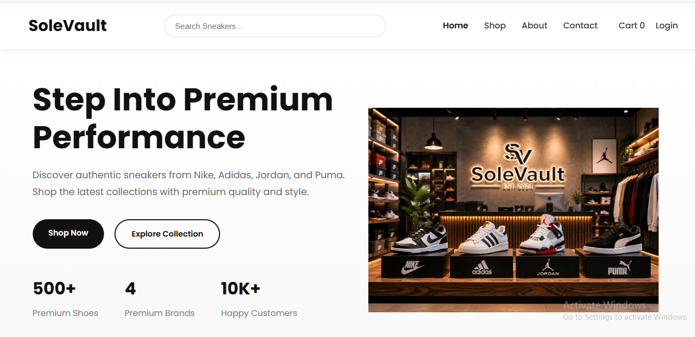
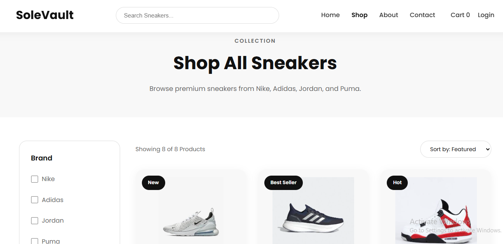
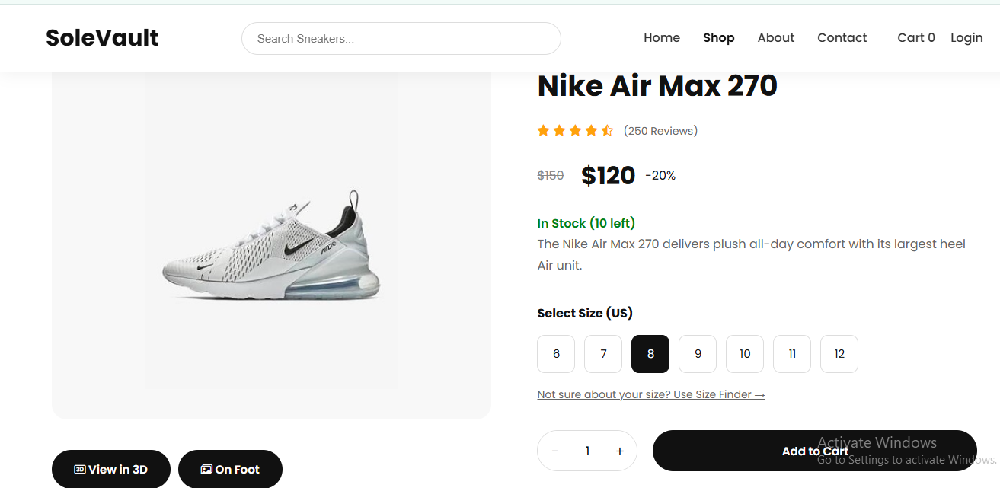

# SoleVault – Premium Sneaker Store

SoleVault is a modern responsive sneaker e-commerce website developed using HTML, CSS and JavaScript. The project showcases premium sneakers from Nike, Adidas, Jordan and Puma with an interactive shopping experience and 3D product viewing.

---

## Live Demo

**Website:** https://sole-vault-store.netlify.app
---

## GitHub Repository

https://github.com/Roman-Arshad/SoleVault-Premium-Sneaker-store

---

# Features

- Responsive design (Mobile, Tablet & Desktop)
- Modern UI/UX
- Product search
- Product filters
- Product details page
- Multiple shoe color selection
- Image gallery
- On-foot preview gallery
- Stock availability indicator
- Shopping cart
- Size Finder
- Checkout page
- 3D Shoe Viewer using Three.js
- Newsletter section
- Contact page
- About page

---

# Technologies Used

- HTML5
- CSS3
- JavaScript (ES6)
- Three.js
- Git & GitHub
- Netlify

---

# Folder Structure

```
SoleVault
│
├── assets
│   ├── css
│   ├── images
│   ├── js
│   └── models
│
├── pages
│
├── screenshots
│
├── index.html
└── README.md
```

---

# Screenshots

## Home Page



---

## Shop Page



---

## Product Page



---

# How to Run

1. Download or clone the repository.

```
git clone https://github.com/Roman-Arshad/SoleVault-Premium-Sneaker-store.git
```

2. Open the project folder.

3. Open `index.html` in your browser.

No installation is required.

---

# AI Assistance

ChatGPT was used to assist with:

- Debugging JavaScript
- Improving responsive layouts
- Developing the search functionality
- Implementing the product gallery
- Building the 3D shoe viewer
- Code optimization and troubleshooting

All project logic was reviewed, understood, integrated, and tested before submission.

---

# Author

**Roman Arshad**

BS Computer Science

M-Tech Internship Project

2026